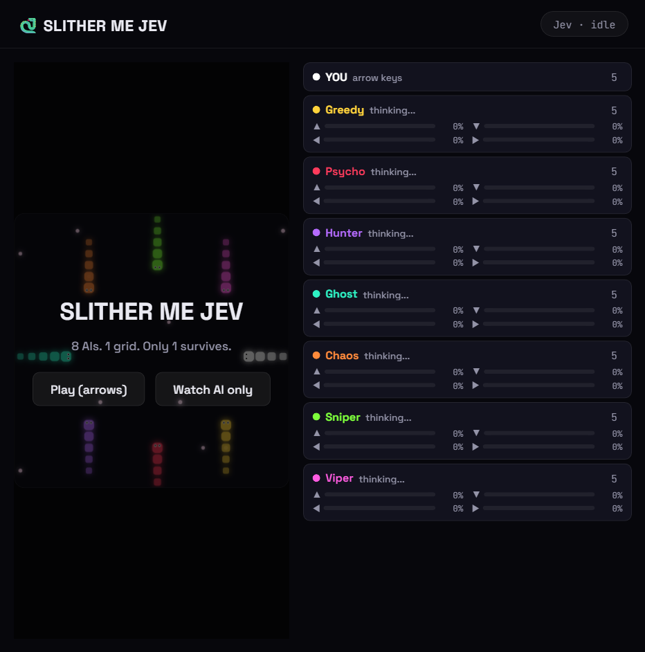
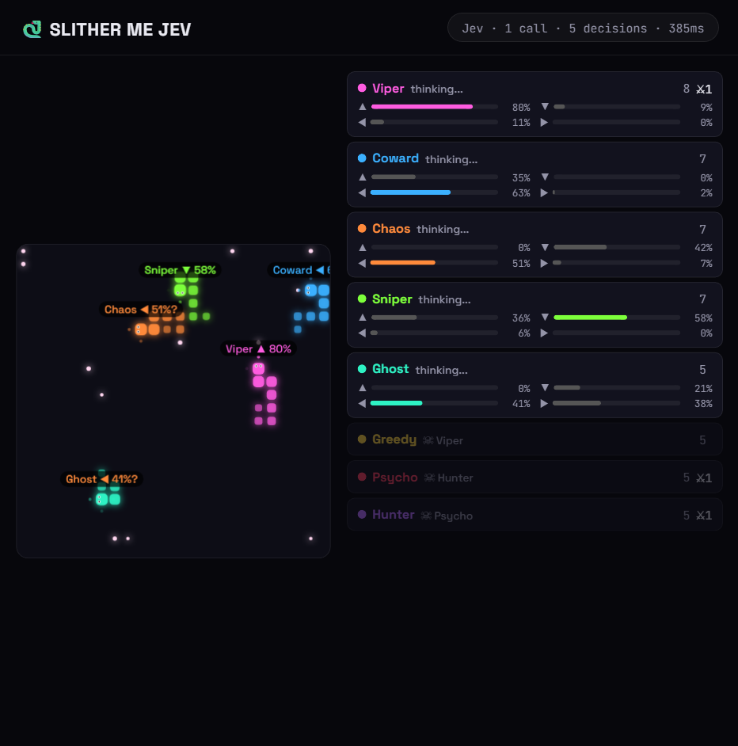

# 🐍 Slither Me Jev

8 AI snakes, 1 human, 1 arena. Every AI snake is driven live by [TypeSafe's Jev](https://typesafe.ai) model — one call per game tick decides all 7 (or 8) moves in parallel, with each snake's confidence shown floating over its head.

### Menu


### Gameplay


*(gameplay recording added separately)*

## Run it

```bash
npm i
cp .env.example .env   # add your TYPESAFE_API_KEY
node server.js
```

Open `http://localhost:3000`.

## Modes & controls

| Key / flag | Effect |
|---|---|
| Arrow keys | Steer your snake (Play mode) |
| `Space` / `P` | Pause / resume |
| `O` | Toggle the odds tags over each head |
| `R` | Restart |
| `?watch=1` | Skip the start screen — 8 Jev snakes only, no human |
| `?rec=1` | Hide the cursor, for recording |

## How Jev fits in

Every tick, the game works out each snake's legal moves and the hard facts about them — distance to the nearest food, distance to the nearest enemy head, and how much open space that move leads to. All of that is sent to Jev as **one call** with **one `choice` question per AI snake**, and Jev answers every one of them in parallel with a move and a probability. The game only ever offers Jev options that are legal, so it can never pick an illegal move.

Each AI snake also gets a personality (Psycho hunts, Greedy chases food, Coward avoids fights, and so on), fed straight into its question so the same facts produce different decisions per snake.

Jev is only called while a round is actually playing — never on the start screen, the win screen, while paused, or while the tab is hidden — to keep API usage to what's actually needed.

## Stack

Vanilla JS + canvas on the frontend, a small Express server as the Jev bridge. No build step, no framework.
